># 软件准备&资料下载
[TI MSPG3507资料总页面](https://www.ti.com.cn/tool/cn/LP-MSPM0G3507?keyMatch=mspm0g3507&tisearch=universal_search&usecase=partmatches)
下载SDK文件和CCS编译器

注意：这两个文件一定要安装在同一个目录下

SDK文件总览：安装成功的SDK文件夹mspm0_sdk_2_03_00_07/docs/chinese/MSPM0_SDK_Documentation_Overview_CN.html
其中点击Driverlib 指南>MSPM0G1X0X_G3X0X DriverLib 指南driverlib库
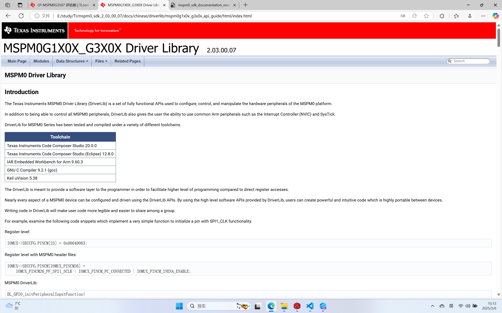

># 新建工程
打开ccs 文件>import projects>browse...
mspm0_sdk_2_03_00_07\examples\nortos\LP_MSPM0G3507\driverlib\empty
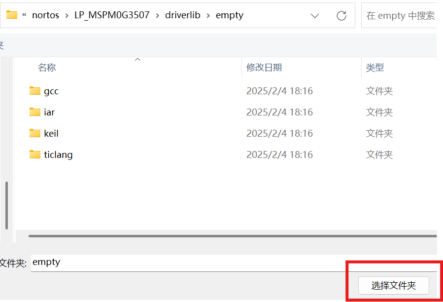
到这一步点击选择文件夹>选择ticang文件>finish
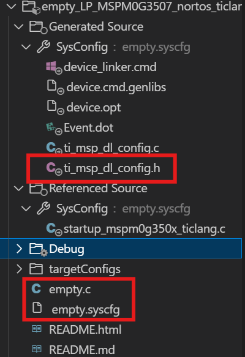
ti_msp_dl_config.h宏定义文件
.c文件为主函数，syscfg文件进行图形化配置

编译：project>build projects 快捷键Ctrl+B
烧录：运行>debug project 快捷键F5

># GPIO
## 配置
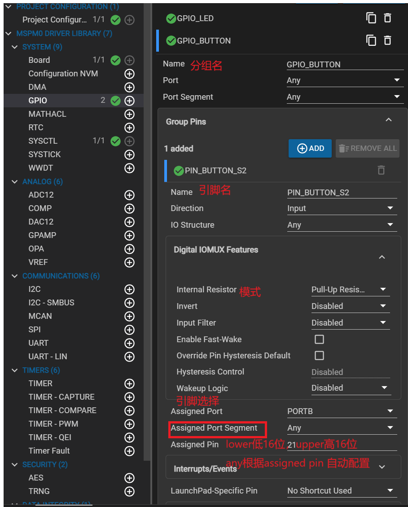
Timer Clock Frequency=32000000/Timer Clock Divider/Timer Clock Prescaler

># TIM
## 资源总览
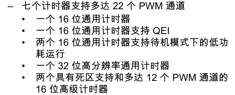
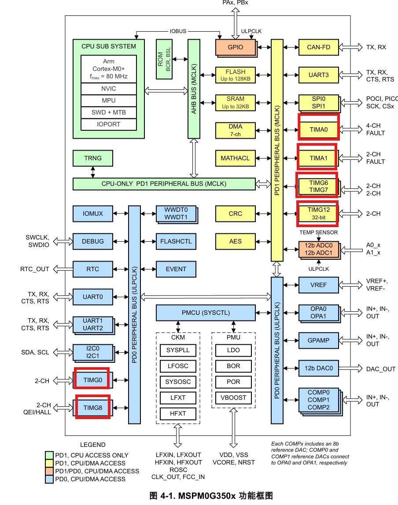
TIMA(advanced)高级定时器   
TIMG(general)通用定时器
## 配置
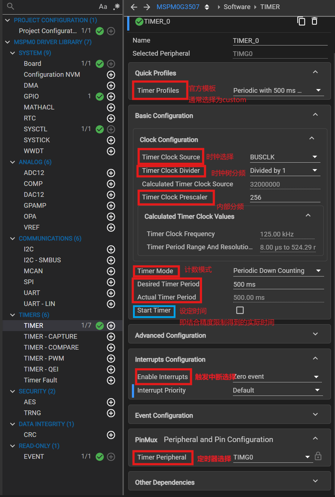
Timer Clock Source 时钟选择
BUSCLK:主系统时钟，为PD1外设提供总线时钟（BUSCLK），系统初始化为32MHz；
LFCLK：低频时钟，就是低频振荡器输出的32.768KHz；
MFCLK：中频时钟，固定4MHz不变，使用的是SYSOC振荡器分频来，系统初始化默认关闭，需要软件打开；

Start Timer 是否在程序开始时即自动启用计数器。若不勾选则需使用DL_TimerG_startCounter()函数手的手动启用

## 代码
```C
int main(void)
{
    SYSCFG_DL_init();

    NVIC_EnableIRQ(TIMER_0_INST_INT_IRQN);//开启中断
    //DL_SYSCTL_enableSleepOnExit();//结束时进入sleep模式以节省功耗
 
    DL_TimerG_startCounter(TIMER_0_INST);//开启计数器

    while (1) {
       // __WFI();//wait for interrupt 等待中断，即下一次中断发生前都在此hold住不干活,可由任意中断唤醒
    }
}

void TIMER_0_INST_IRQHandler(void)
{
    switch (DL_TimerG_getPendingInterrupt(TIMER_0_INST)) {//判断当前最高优先级的中断并且清楚该标志位
        case DL_TIMER_IIDX_ZERO://检查是否为Enable interrupts所选中断
            DL_GPIO_togglePins(GPIO_LEDS_PORT,
                GPIO_LEDS_USER_LED_1_PIN | GPIO_LEDS_USER_TEST_PIN);
            break;
        default:
            break;
    }
}
```
```C
#define TIMER_0_INST                                                     (TIMG0)//定时器
#define TIMER_0_INST_IRQHandler                                 TIMG0_IRQHandler//中断函数
#define TIMER_0_INST_INT_IRQN                                   (TIMG0_INT_IRQn)//中断
```

模式与低功耗
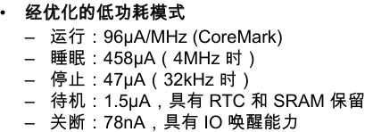

># PWM
## 配置
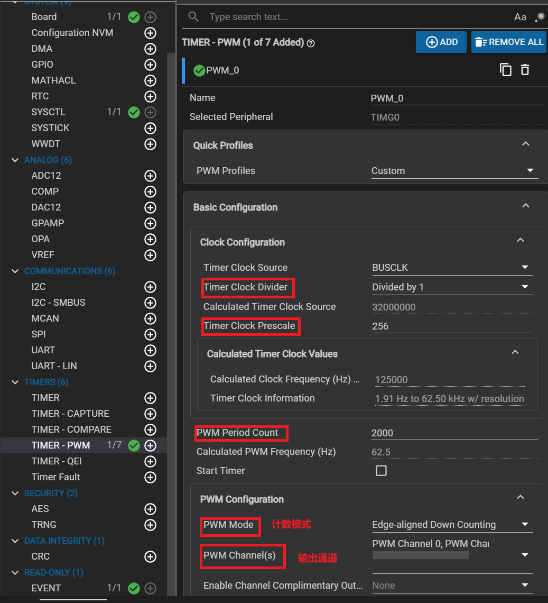
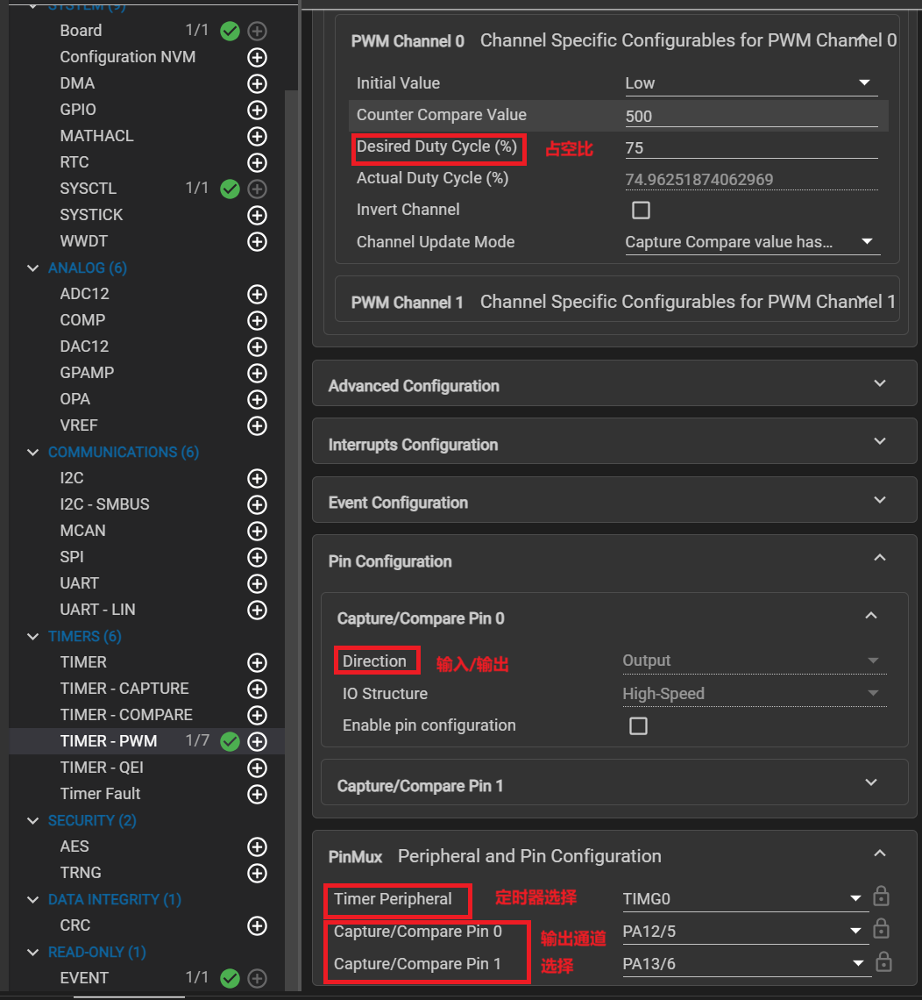
Calculated Clock Frequency (Hz)=32000000/Timer Clock Divider/Timer Clock Prescale/PWM Period Count

PWM Mode 边沿对齐/中心对齐:影响相位
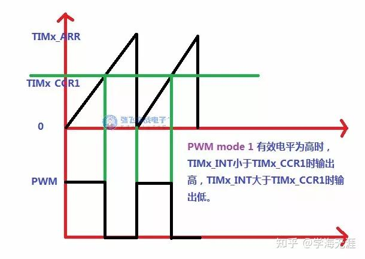
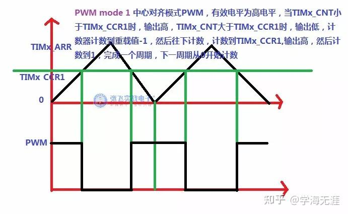
向上计数/向下计数，这两种生成PWM的方式，我们通常称为边沿对齐PWM；
既向上又向下这种生成PWM的方式，我们称为中心对齐PWM。

Counter Compare Value=PWM Period Count*（1-Desired Duty Cycle (%)）

## 代码
```c
int main(void)
{
    SYSCFG_DL_init();

    DL_TimerG_startCounter(PWM_0_INST);//开启计数器

    while (1) {
        __WFI();
    }
}
```
封装频率调节函数和占空比调节函数
```c
uint32_t period=32000;//PWM Period Count
void SetFrequency(uint32_t frequency){
    period = PWM_0_INST_CLK_FREQ/frequency; 
    DL_TimerG_setLoadValue(PWM_0_INST,period);
}
void SetDuty(float duty,uint8_t channel){
    uint32_t CompareValue;
    CompareValue=period*(1-duty);

    if(channel == 0){
        DL_TimerG_setCaptureCompareValue(PWM_0_INST,CompareValue,GPIO_PWM_0_C0_IDX);
    }
    else if(channel == 1){
        DL_TimerG_setCaptureCompareValue(PWM_0_INST,CompareValue,GPIO_PWM_0_C1_IDX);
    }
}
```

># ADC 
## 单通道
### 配置
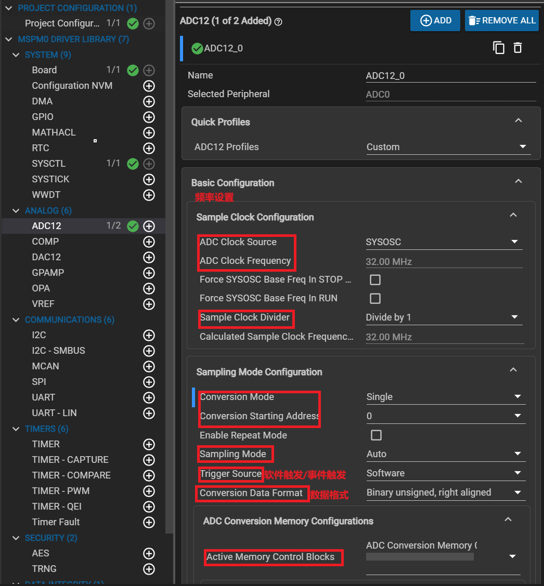
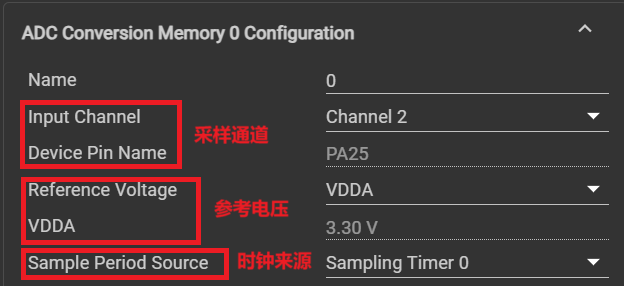
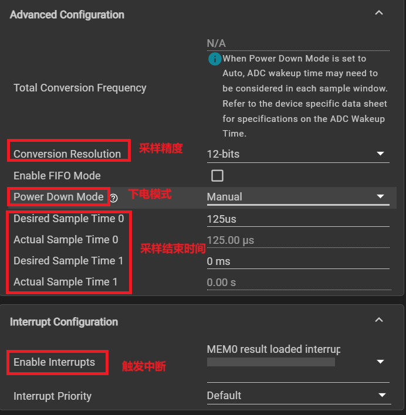
Conversion Mode 转换模式:单通道/多通道
需与Active Memory Control Blocks 内存位置 对应

Sampling Mode 采样模式
Manual 手动：应用程序通过DL_ADC12_startConversion和DL_ADC12_stopConversion控制采样时间
Auto 自动：ADC12通过“Advanced Configuration”部分的“Sample Time 0”和“Sample Time 1”参数控制采样时间

Input Channel 采样通道与 Device Pin Name 引脚 对应关系
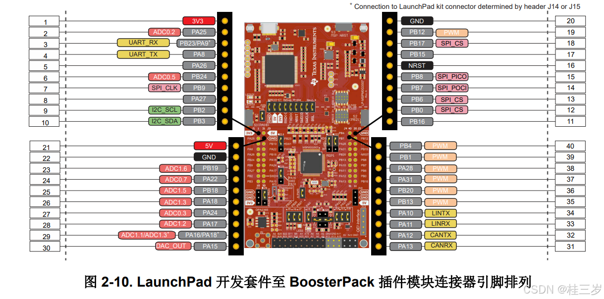

Power Down Mode 下电模式
AUTO 自动：如果没有等待的触发器，ADC在转换完成时关闭电源
MANUAL 手动：只要通过软件使能，ADC一直保持上电状态。

Enable Interrupts 触发中断
勾选最后一个通道完成转换时置中断标志位，以便程序中判断ADC转换是否完成。

### 代码
```C
volatile bool ADC_Flag;//中断标志位
volatile uint32_t ADC_Val;

int main(void)
{
    SYSCFG_DL_init();
    NVIC_EnableIRQ(ADC12_0_INST_INT_IRQN);
    while (1) {
        ADC_Flag = false;
        DL_ADC12_startConversion(ADC12_0_INST);

        While(ADC_Flag == false);//等待ADC转换完成

        ADC_Val=DL_ADC12_getMemResult(ADC12_0_INST, DL_ADC12_MEM_IDX_0);
        DL_ADC12_enableConversions(ADC12_0_INST);//由于·每次转换结束ADC会自动关闭。所以需手动打开以确保下一次准换能够进行
    }
}
void ADC12_0_INST_IRQHandler(void){
     switch (DL_ADC12_getPendingInterrupt(ADC12_0_INST)) {
        case DL_ADC12_IIDX_MEM0_RESULT_LOADED:
            ADC_Flag = true;
            break;
        default:
            break;
    }

}
```
## 多通道
### 配置
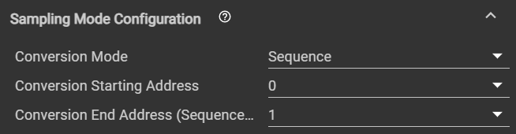
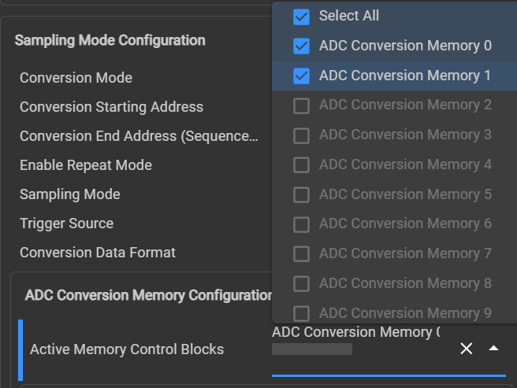
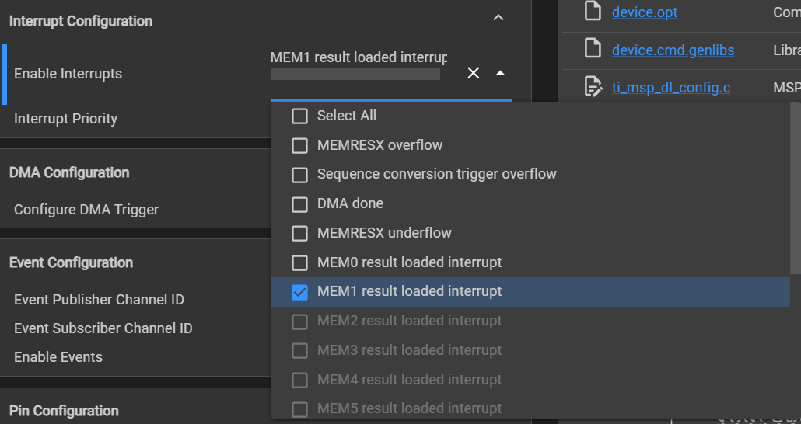
### 代码
```c
#include "ti_msp_dl_config.h"
volatile bool ADC_Flag;
volatile uint16_t ADC_Val0,ADC_Val1;

int main(void)
{
    SYSCFG_DL_init();
    NVIC_EnableIRQ(ADC12_0_INST_INT_IRQN)
    while (1) {
        ADC_Flag=false;
        DL_ADC12_startConversion(ADC12_0_INST);

        while(ADC_Flag==false);
        ADC_Val0=DL_ADC12_getMemResult(ADC12_0_INST, DL_ADC12_MEM_IDX_0);
        ADC_Val1=DL_ADC12_getMemResult(ADC12_0_INST, DL_ADC12_MEM_IDX_1);
        DL_ADC12_enableConversions(ADC12_0_INST);
    }
}
void ADC12_0_INST_IRQHandler(void){
    switch (DL_ADC12_getPendingInterrupt(ADC12_0_INST)) {
        case DL_ADC12_IIDX_MEM1_RESULT_LOADED:
            ADC_Flag = true;
            break;
        default:
            break;
    }
}
```
># DAC
## 配置
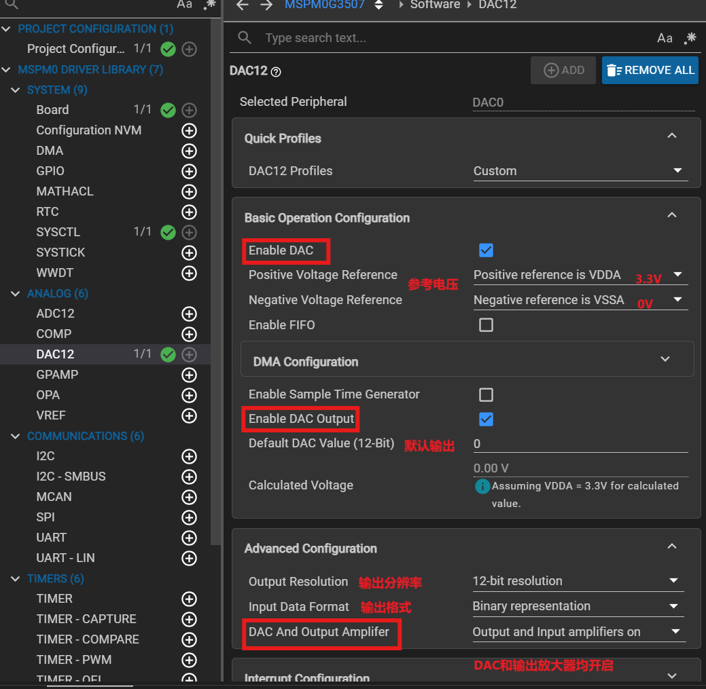
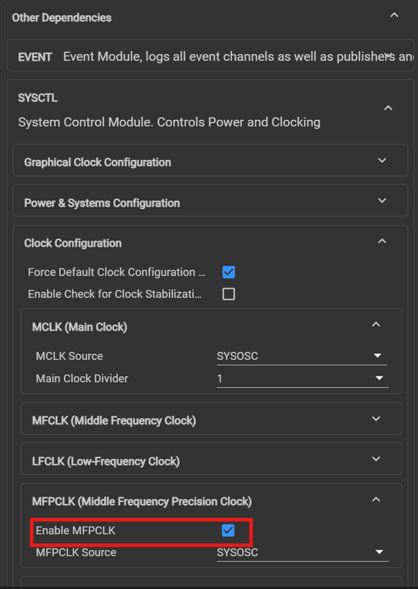
要使用DAC12，必须开启MFPCLK
Other Dependencies>SYSCTLClock Configuration>MFPCLK (Middle Frequency Precision Clock)>Enable MFPCLK
## 代码
```c
int main(void)
{
    uint32_t DAC_value;

    SYSCFG_DL_init();

    DAC_value = (DAC12_OUTPUT_VOLTAGE_mV * 4095) / DAC12_REF_VOLTAGE_mV;//输出分辨率为12bit→4095

    DL_DAC12_output12(DAC0, DAC_value);
    DL_DAC12_enable(DAC0);

    while (1) {
        
    }
}
```

># UART
## 配置
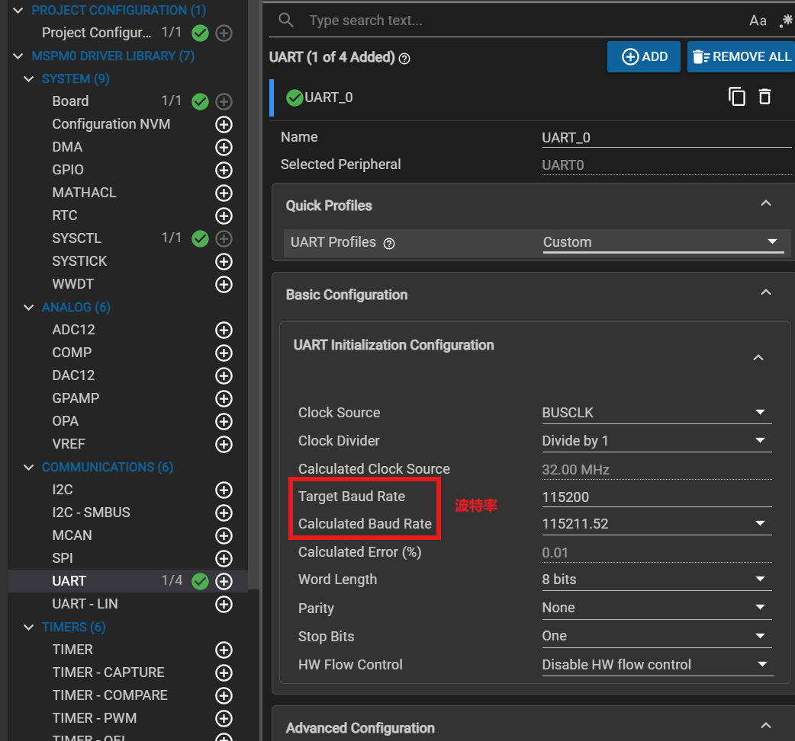
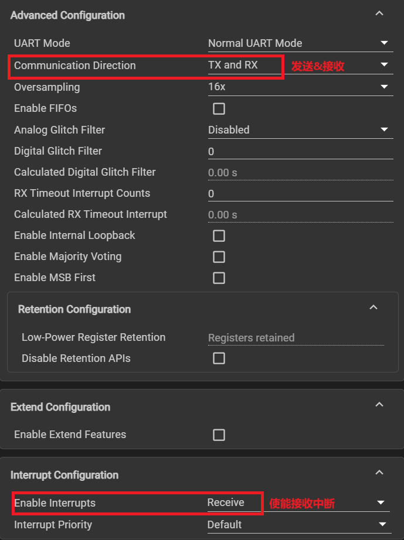
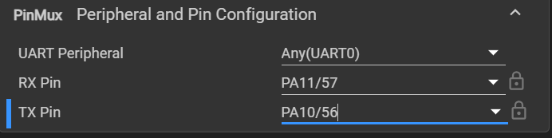
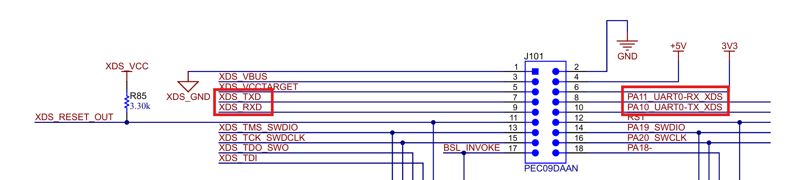
选择PA11 PA10,以便传送到XDS做还回
一般情况则可随意选择引脚
## 代码
```C
volatile uint8_t gEchoData = 0;

int main(void)
{
    SYSCFG_DL_init();
    NVIC_ClearPendingIRQ(UART_0_INST_INT_IRQN);//清除标志位
    NVIC_EnableIRQ(UART_0_INST_INT_IRQN);//开启中断

    while (1) {
    }
}
void UART_0_INST_IRQHandler(void){
     switch (DL_UART_Main_getPendingInterrupt(UART_0_INST)) {
        case DL_UART_MAIN_IIDX_RX:
            gEchoData = DL_UART_Main_receiveData(UART_0_INST);//接收
            DL_UART_Main_transmitData(UART_0_INST, gEchoData);//发送
            break;
        default:
            break;
}
```
># CMSIS-DSP
## CMSIS-DSP用户手册
[CMSIS-DSP用户手册](https://arm-software.github.io/CMSIS-DSP/latest/)
## 新建工程
详见SDK文件总览：安装成功的SDK文件夹mspm0_sdk_2_03_00_07/docs/chinese/MSPM0_SDK_Documentation_Overview_CN.html>3rd Party Documentation>CMSIS DSP
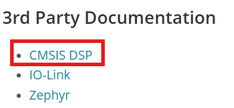
### 使用 CMSIS DSP 示例
mspm0_sdk_2_03_00_07>examples>nortos>LP_MSPM0G3507>cmsis_dsp
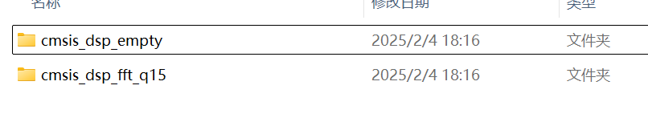
### 向现有工程添加 CMSIS DSP
* 第一步
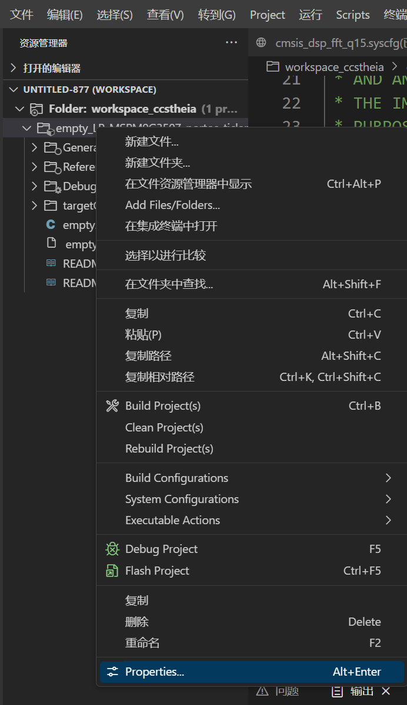
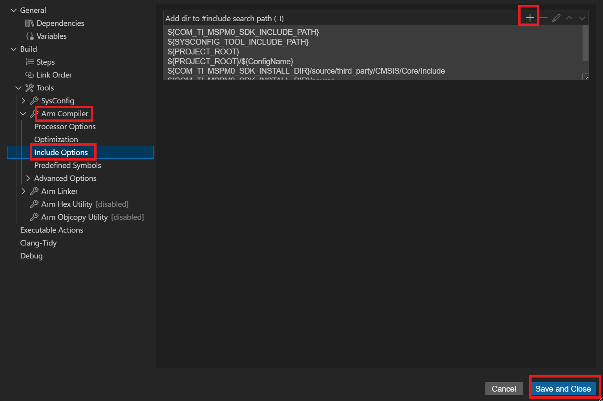
点击+号后粘贴路径${COM_TI_MSPM0_SDK_INSTALL_DIR}/source/third_party/CMSIS/DSP/Include
* 第二步
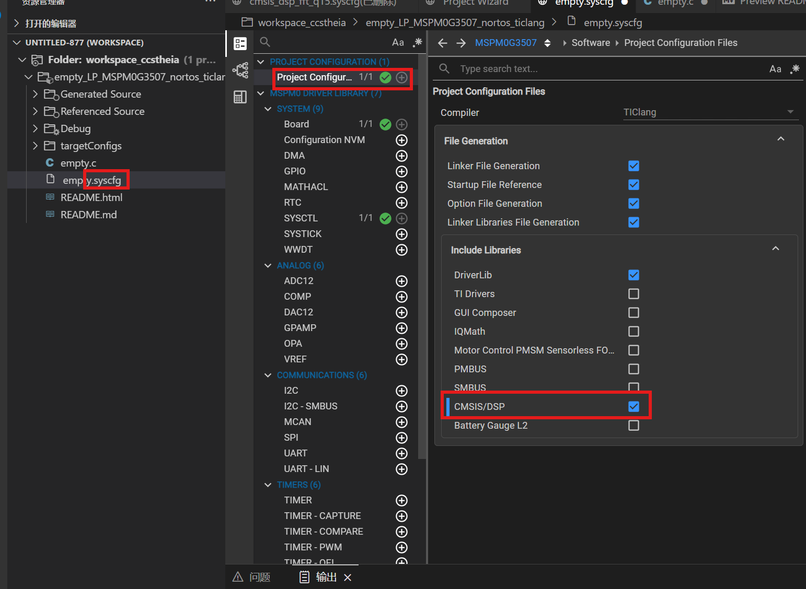
* 第三步
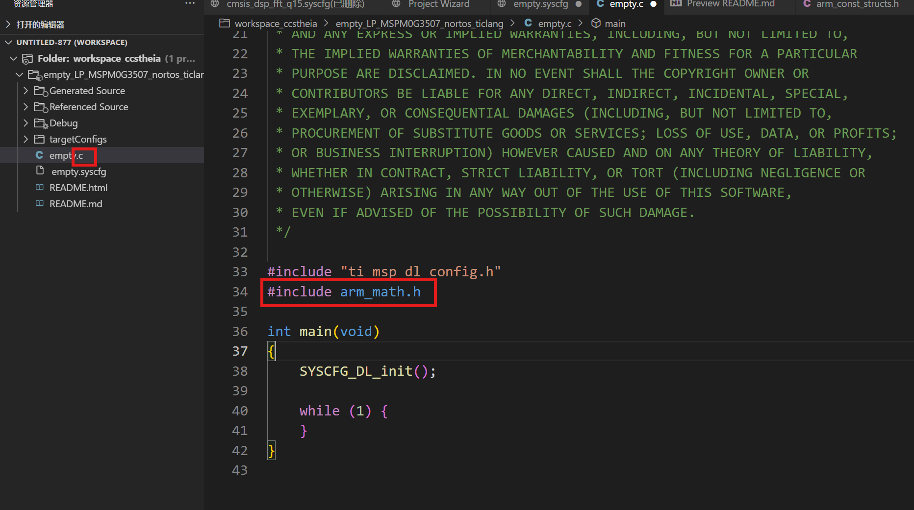
## 图形化工具
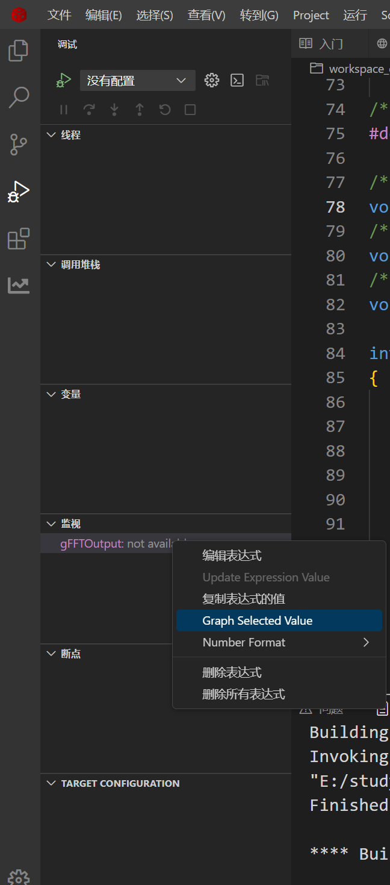
## 代码
```c
#include "arm_const_structs.h"
#include "arm_math.h"
#include "ti_msp_dl_config.h"

#define NUM_SAMPLES 256//样本数量
#define IFFTFLAG 0//正向变换
#define BITREVERSE 1//启用输出位反转

static uint32_t gDstBuffer[NUM_SAMPLES] = {0, 4091, 8021, 11639, 14810, 17421,
    19391, 20671, 21246, 21137, 20397, 19109, 17378, 15325, 13078, 10767, 8513,
    6421, 4577, 3040, 1839, 976, 424, 128, 16, 0, -16, -128, -424, -976, -1839,
    -3040, -4577, -6421, -8513, -10767, -13078, -15325, -17378, -19109, -20397,
    -21137, -21246, -20671, -19391, -17421, -14810, -11639, -8021, -4091, 0,
    4091, 8021, 11639, 14810, 17421, 19391, 20671, 21246, 21137, 20397, 19109,
    17378, 15325, 13078, 10767, 8513, 6421, 4577, 3040, 1839, 976, 424, 128,
    16, 0, -16, -128, -424, -976, -1839, -3040, -4577, -6421, -8513, -10767,
    -13078, -15325, -17378, -19109, -20397, -21137, -21246, -20671, -19391,
    -17421, -14810, -11639, -8021, -4091, 0, 4091, 8021, 11639, 14810, 17421,
    19391, 20671, 21246, 21137, 20397, 19109, 17378, 15325, 13078, 10767, 8513,
    6421, 4577, 3040, 1839, 976, 424, 128, 16, 0, -16, -128, -424, -976, -1839,
    -3040, -4577, -6421, -8513, -10767, -13078, -15325, -17378, -19109, -20397,
    -21137, -21246, -20671, -19391, -17421, -14810, -11639, -8021, -4091, 0,
    4091, 8021, 11639, 14810, 17421, 19391, 20671, 21246, 21137, 20397, 19109,
    17378, 15325, 13078, 10767, 8513, 6421, 4577, 3040, 1839, 976, 424, 128,
    16, 0, -16, -128, -424, -976, -1839, -3040, -4577, -6421, -8513, -10767,
    -13078, -15325, -17378, -19109, -20397, -21137, -21246, -20671, -19391,
    -17421, -14810, -11639, -8021, -4091, 0, 4091, 8021, 11639, 14810, 17421,
    19391, 20671, 21246, 21137, 20397, 19109, 17378, 15325, 13078, 10767, 8513,
    6421, 4577, 3040, 1839, 976, 424, 128, 16, 0, -16, -128, -424, -976, -1839,
    -3040, -4577, -6421, -8513, -10767, -13078, -15325, -17378, -19109, -20397,
    -21137, -21246, -20671, -19391, -17421, -14810, -11639, -8021, -4091, 0,
    4091, 8021, 11639, 14810, 17421};
//输入数据，实际应用中可配合ADC采集获得

volatile int16_t gFFTOutput[NUM_SAMPLES * 2];//结果
volatile uint32_t gFFTmaxValue;//最大值
volatile uint32_t gFFTmaxFreqIndex;//最大值索引

int main(void)
{
    SYSCFG_DL_init();

    arm_cfft_q15(&arm_cfft_sR_q15_len256, (q15_t *) gDstBuffer, IFFTFLAG, BITREVERSE);//做fft变换
    arm_cmplx_mag_q15((q15_t *) gDstBuffer, (q15_t *) gFFTOutput, NUM_SAMPLES);//计算模值
    arm_max_q15((q15_t *) gFFTOutput, NUM_SAMPLES, (q15_t *) &gFFTmaxValue,(uint32_t *) &gFFTmaxFreqIndex);//计算最大值及其索引

    while (1) {

    }
}
```
DSP中常用数据格式
1. 浮点数格式
* F16（半精度浮点数）
位数：16位
格式：1位符号位，5位指数位，10位尾数位
范围：大约 ±6.10352 × 10^-5 到 ±65504
用途：适用于资源受限的嵌入式系统，节省存储空间和计算资源。
* F32（单精度浮点数）
位数：32位
格式：1位符号位，8位指数位，23位尾数位
范围：大约 ±1.17549435 × 10^-38 到 ±3.40282347 × 10^38
用途：广泛用于一般计算，平衡了精度和资源消耗。
* F64（双精度浮点数）
位数：64位
格式：1位符号位，11位指数位，52位尾数位
范围：大约 ±2.22507386 × 10^-308 到 ±1.79769313 × 10^308
用途：用于需要高精度的计算，如科学计算和金融分析。
2. 定点数格式
* Q15
位数：16位
格式：1位符号位，15位小数位
范围：-1.0 到 0.999969482421875
用途：适用于需要高精度小数运算的场景，常用于音频处理和滤波器设计。
* Q31
位数：32位
格式：1位符号位，31位小数位
范围：-1.0 到 0.9999999999999999
用途：适用于需要更高精度的定点数运算，常用于复杂的信号处理和控制算法。

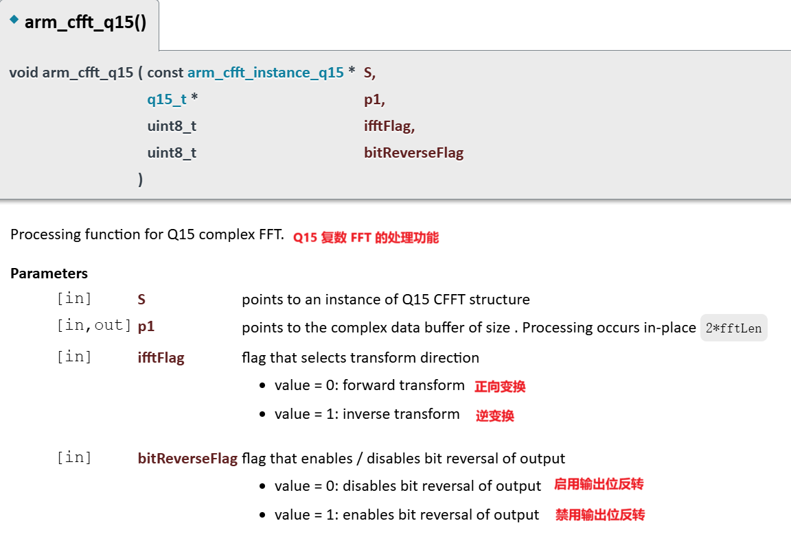
如何判断是否进行 FFT 逆运算和位反转
* FFT 逆运算：
如果你需要将频域数据转换回时域数据，应该设置 ifftFlag 为 1。
如果你需要将时域数据转换为频域数据，应该设置 ifftFlag 为 0。
* 位反转：
如果你需要在 FFT 或 IFFT 之后将数据重新排列为自然顺序，应该设置 bitReverseFlag 为 1。
如果你不需要重新排列数据，可以设置 bitReverseFlag 为 0。

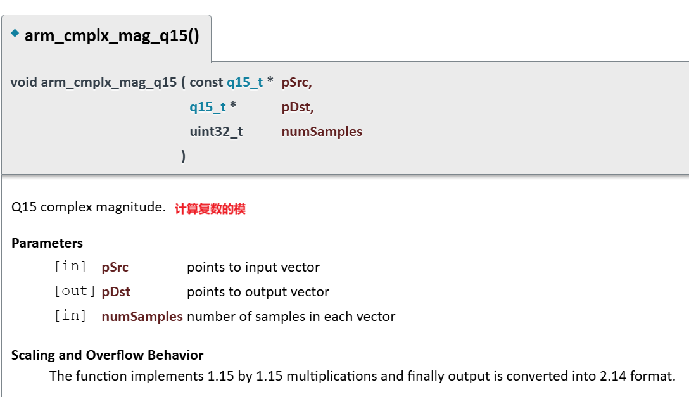

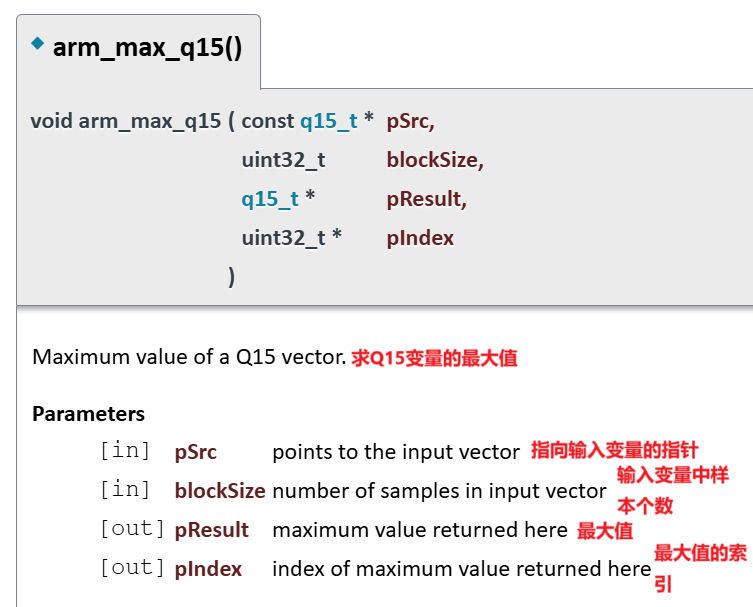